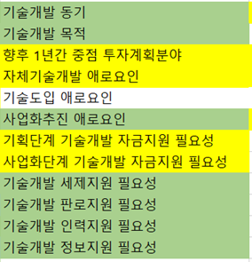

# 0416_conference

## 규민

> 1. Clustering vs Classification 
>
> 2. Clustering의 대표적 5가지방법 장/단점
>
> 3. 기준3의 활용데이터 구상

#### - Clustering 대표 5가지방법

- K-Means
- Mean-Shift Clustering
- DBSCAN (Density-Based Spatial Clustering of Applications with Noise)
- GMM (Expectation-Maximization (EM) Clustering using Gaussian Mixture Models)
- Agglomerative Hierarchical Clustering

#### - 기준3의 활용데이터

- 기술개발 애로요인`H1` -> 원하는게 다를듯
- 기술개발 지원제도필요 시기 `I3태그`-
- 수출여부
- 대기업납품여부
- 향후 1년간 중점 투자계획분야
- 단계별 기술개발 자금지원 필요성
- 개발기술 사업화를 위해 가장 필요한 지원책

#### - 아이디어

```
- 각자 분석기법맡아서 한두개씩 해보고 좋은거 찾아보기
- 군집수를 정해놔야 mbti 가짓수 가 적어진다.
  -> 너무 군집이 많아지면 데이터양 부족 우려됨 
```


------

## 인영

> 기준3 활용가능 변수 탐색

#### - 탐색변수

- 규모`
- `업체설립년도`
- `주력제품매출액비중`
- `기업성장단계`
- `기술개발동기`
- `기술개발목적`
- `향후 1년간 중점 투자계획분야`
- `자체기술개발 애로요인`
- `기술도입 애로요인`
- `사업화추진 애로요인`
- `기획단계`/ `사업화단계`/ `기술개발`/ `지원필요성`
- `개발기술 사업화를 위해 가장 필요한 지원책`

#### - 아이디어

```
파라미터 튜닝에 유의하자!
```


---

## 동석

> 1. 변수 응답 범주 축소 아이디어 구상
>
> 2. 기준3 변수 탐색

#### - 변수선택

- 거래처별 매출액 비중 (sep6 , sep6n, sep7, sep8, sep9, sep10)
- 기술개발목적 (a1n1, a1n2) + 지난 1년간 중점 투자분야 
  - \+ 향후 1년간 투자계획분야 (1,신제품 개발 / 2. 기존제품 개선 / 3. 신공정 개발/   4.기존공정 개선)을 넣으면 더 좋을 듯 (c2s1, c2s2)
- 아이디어 정보 획득방법 (a4s1, a4s2, a4s3)
- 기존개발 전담조직 형태 (B1)
- 기술 관련 애로요인
- 사업화추진 애로요인
- 단계별 기술개발 자금지원 필요성 (기획 + 개발 + 사업화)/3
- 기술개발 세제지원 , 판로지원, 인력 지원, 정보지원
- 선호하는 정부의 기술개발 지원형태
- 그 외 생각해볼 수 있는 변수
  - 개발기술 사업화를 위해 가장 필요한 지원책
  - 제품의 시장도입에서 쇠퇴기까지의 기간 (2번째 분류표 : 제품수명주기에 넣어도 좋을 듯)
  - 기술개발 실패요인 
  - 기술개발 성공요인  -> 3,4번은 분석 후 넣을지 말지 고민... 5,6번의 애로요인과 비슷할 듯 

#### - 아이디어

```
3번째 항목에 넣을 변수가 많으니, 그 전에
비슷한 것들은 파생변수로 합쳐서 변수 개수를 줄이고 (매핑)
-> 군집분석을 실시하자.
```


------

## ★팀결론★

- 기준3 변수 선택



- 파생변수 생성 -> 변수개수 줄이는것 동의

  #### 해야할것(~04/16)

  - 변수 줄이는 방안 구상해오기
  - Clustering 모델 두개씩 공부 해오기
    - 규민: K-means + else
    - 인영: Meanshift + DBSCAN
    - 동석:GMM + Agglomerative